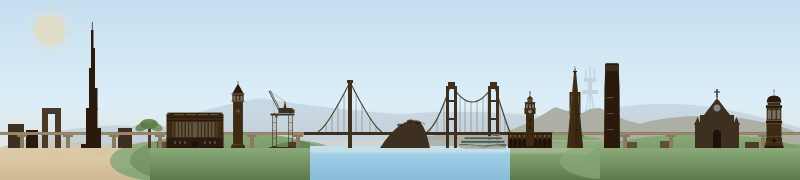

# yashdave003.github.io

Personal academic website for **Yash Dave** — Stanford ICME, [STAIR Lab](https://stair.stanford.edu/). AI measurement science; bridging technical and policy questions in AI.

→ Live at **[yashdave003.github.io](https://yashdave003.github.io)**.

The footer banner above is a single 800×180 inline SVG: skyline left-to-right runs **Dubai → Berkeley → SF → Stanford**, with the rolling stock swapping identity per zone — Dubai Metro out of the Burj, F-line bus through Berkeley and SF, Caltrain EMU down the Peninsula. Click the sun/moon to flip light/dark; click the banner to pause.

## Stack

Plain HTML, CSS, and vanilla JavaScript — no framework, no build step. Hosted on GitHub Pages.

- `index.html` (about) · `research.html` · `teaching.html` · `projects.html` · `404.html`
- Shared theme + behaviour in `assets/css/main.css` and `assets/js/main.js`
- Footer SVG lives as a template literal in `main.js` and is injected at runtime so it stays a single source of truth across pages

## License

Code is [MIT](LICENSE) — fork the layout or the animation for your own academic site. Content (bio, photo, research descriptions, the specific skyline composition) is mine and remains under default copyright.
